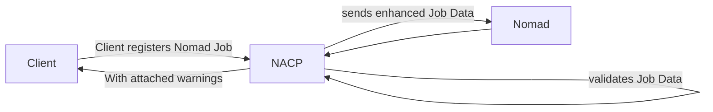

# Nomad Admission Control Proxy (NACP)

This proxy acts as a middleman between the Nomad API and the Nomad client.

It intercepts the Nomad API calls that include job data (plan, register, validate) and performs the following actions:

1. Mutate the Job Data
2. Validate the mutated Job Data

If any errors occur the proxy will return the error to the Nomad API caller.

Warnings are attached to the Nomad response when they come back from the actual Nomad API.



Currently it supports following mutator and validators:
- Opa Engine for the validation and mutation.
- Webhook for the validation and mutation.


## Usage
### Run Proxy

```bash
$ nacp -config config.hcl
```

It will launch per default on port 6464.

### Send Job to Nomad via Proxy

```bash
NOMAD_ADDR=http://localhost:6464 nomad job run job.hcl
```

### Configuration

```hcl
validator "opa" "some_opa_validator" {

    opa_rule {
        query = "errors = data.costcenter_meta.errors"
        filename = "testdata/opa/validators/costcenter_meta.rego"
    }
}

mutator "opa_jsonpatch" "some_opa_mutator" {

    opa_rule {
        query = "patch = data.hello_world_meta.patch"
        filename = "testdata/opa/mutators/hello_world_meta.rego"
    }
}

```
