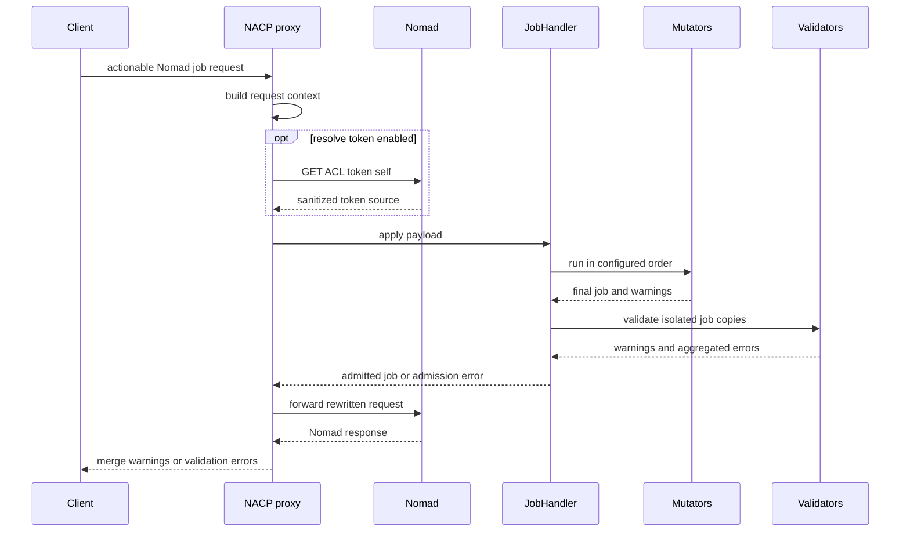

# Proxy and admission pipeline

`cmd/nacp/nacp.go` builds NACP around Go's `httputil.NewSingleHostReverseProxy`. `newProxyHandler` composes `resolveRequestContext`, `applyAdmission`, and `modifyProxyResponse` around that proxy. Ordinary Nomad API traffic is forwarded, while job-bearing admission routes are decoded, evaluated by controllers configured through [policy integrations and configuration](policy-integrations.md), rewritten with the admitted job, and forwarded when their endpoint rules allow it.

## Intercepted surface

Only `PUT` and `POST` requests matching these paths go through admission:

| Intent | Path | Request handling |
| --- | --- | --- |
| Create/register | `/v1/jobs` | Decode `api.JobRegisterRequest`, admit its `Job`, then forward the rewritten request. |
| Update/register | `/v1/job/<id>` | Same register flow; matching is `jobPathRegex` in `cmd/nacp/nacp.go`. |
| Plan | `/v1/job/<id>/plan` | Decode `api.JobPlanRequest`, admit its `Job`, then forward the rewritten request. |
| Validate | `/v1/validate/job` | Decode `api.JobValidateRequest`, admit its `Job`, forward it, then rewrite Nomad's validation response. |

All other method/path combinations are proxy traffic, not admission traffic. Actionable request bodies are limited to 32 MiB by `maxAdmissionBodySize`; route changes must decide whether that boundary applies and update endpoint tests.

## Request lifecycle and outcomes



This diagram shows the actionable-route path; non-actionable traffic bypasses `JobHandler` and is directly proxied.

1. NACP derives `RequestContext.ClientIP` from the first `X-Forwarded-For` value, falling back to `RemoteAddr`.
2. If any configured controller enables `resolve_token`, an actionable request triggers `GET /v1/acl/token/self` against Nomad with the incoming `X-Nomad-Token`. The context uses `config.SanitizeACLToken`, which excludes the token `SecretID`.
3. The proxy creates `types.Payload` as `{ "job": <api.Job>, "context": <request context> }` and calls `JobHandler.ApplyAdmissionControllers`.
4. `AdmissionMutators` runs mutators in configured order; each sees the prior output. A mutator error or nil job fails fast.
5. `AdmissionValidators` receives the final job but JSON-copies it independently for each validator. It aggregates validator failures with `go-multierror` while retaining warnings. Validators therefore cannot alter the forwarded job.
6. The proxy replaces the request envelope's `Job`, stores warnings (and, for validate, validator errors) in request context, then `ModifyResponse` rewrites successful Nomad responses. Register, plan, and validate response handlers retain gzip encoding when rewriting.

For **register** and **plan**, any admission error produces NACP's local HTTP 500 and the request is not proxied. For **validate**, mutator errors still stop locally, but validator errors are forwarded and merged into Nomad's validation response. This distinction is implemented by `handleRegister`, `handlePlan`, `handleValidate`, and their response handlers in `cmd/nacp/nacp.go`.

## Controller contract

`pkg/admissionctrl/controller.go` defines the extension seam:

```go
type JobMutator interface {
    Name() string
    Mutate(context.Context, *types.Payload) (*api.Job, bool, []error, error)
}

type JobValidator interface {
    Name() string
    Validate(context.Context, *types.Payload) (warnings []error, err error)
}
```

Concrete OPA, SDK/bundle, webhook, and Notation adapters implement these interfaces as described in [policy integrations](policy-integrations.md#controller-families). `NewJobHandler` records whether token resolution is required and creates controller-labeled metrics; it also wraps application, mutation, and validation work in OpenTelemetry spans.

### Change navigation

Consult this page when changing proxy routing, payload lifecycle, error presentation, or a controller interface.

- **Implementation:** start at `newProxyHandler`. `resolveRequestContext` owns request context, admission-body limiting, and optional token lookup; `applyAdmission` dispatches to the relevant `handle*` routine; `modifyProxyResponse` dispatches response rewriting. Sequencing is in `JobHandler.ApplyAdmissionControllers`.
- **Invariants:** do not reorder configured mutators; do not validate a pre-mutation job; preserve validator copies and error aggregation; do not accidentally admit non-actionable routes.
- **Focused tests:** `TestProxy`, `TestJobUpdateProxy`, and `TestAdmissionRouteMatching` cover HTTP behavior. `TestJobHandler_ApplyAdmissionControllers` covers order/errors; `TestJobHandler_ValidatorsReceiveIsolatedCopyOfMutatedJob` protects copy isolation.
- **Validation:** run `go test ./cmd/nacp -count=1` for route/rewrite changes, `go test ./pkg/admissionctrl -count=1` for orchestration changes, or both if the request-handler contract crosses the boundary. A full suite is conditional on cross-package changes.

## Security and transport boundaries

The proxy has independent listener and upstream-Nomad TLS configuration; [operations and testing](operations-testing.md#transport-and-telemetry) explains both. Client IP is policy-visible, so deployments that trust it must sanitize `X-Forwarded-For` before NACP. Resolved token data is serialized in payload context rather than a dedicated remote-policy header; webhook-specific header projection is defined in [policy integrations](policy-integrations.md#webhooks).
